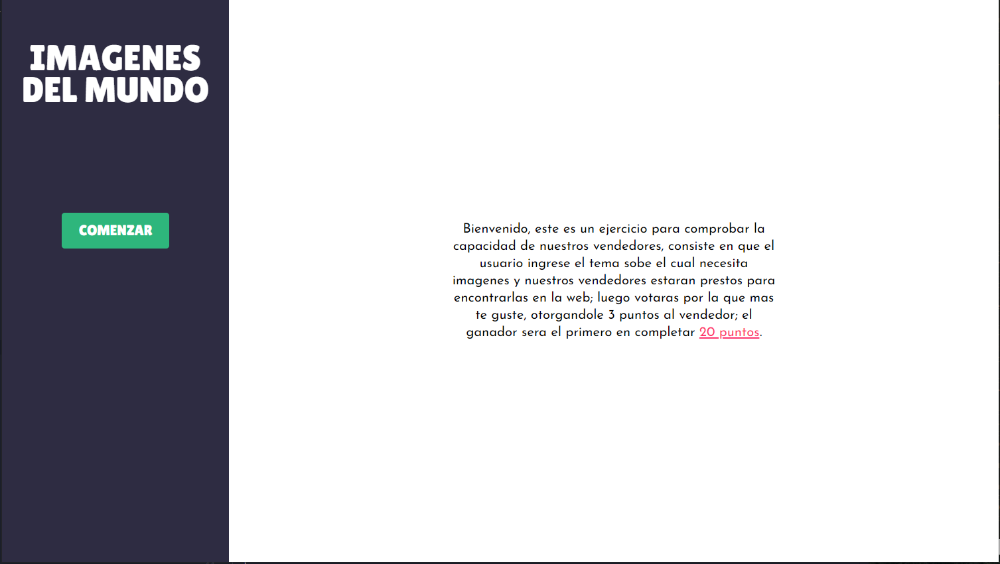
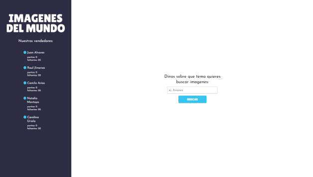
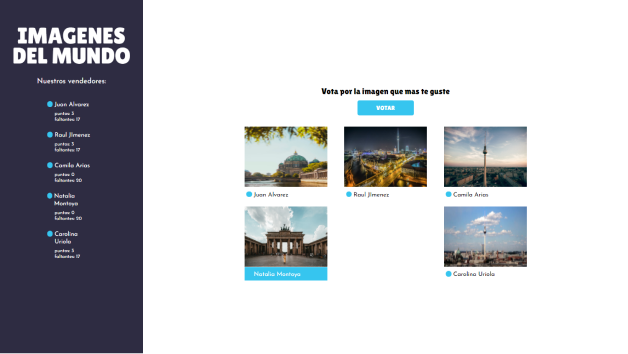
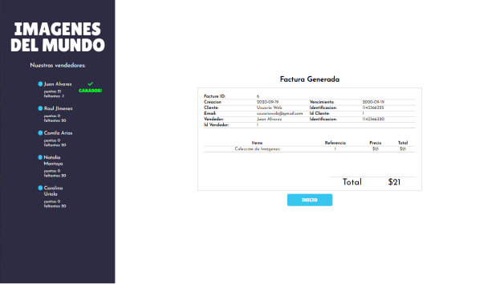
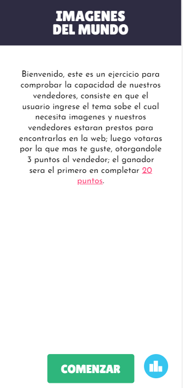
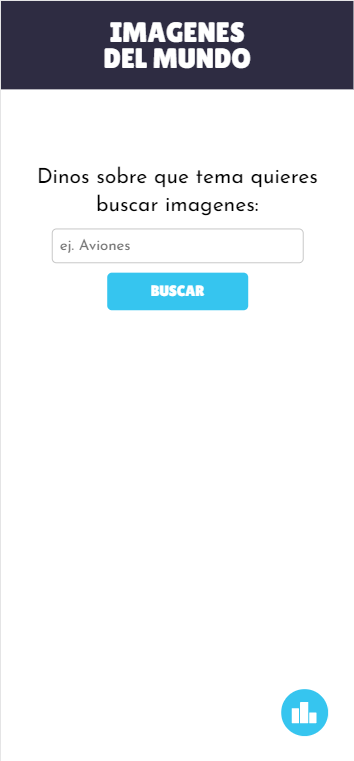
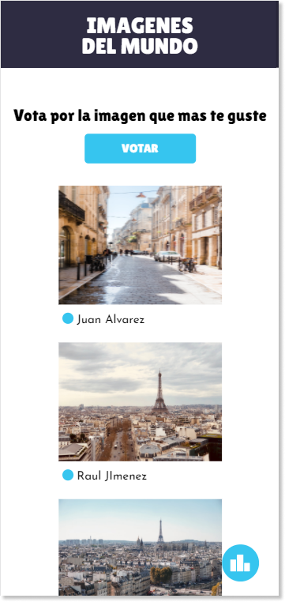
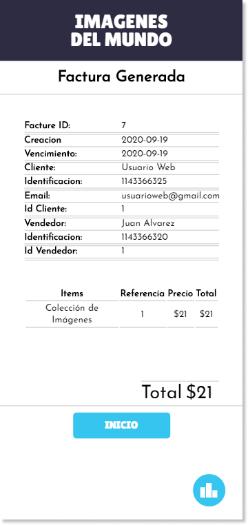

# IMAGENES DEL MUNDO

## Screenshots

  
  

  
  

  
  
  
  

## Requirements

For development, you will only need Node.js

## Install

    $ git clone
    $ cd imdapp
    $ npm install

## Using API
    * Alegra https://developer.alegra.com/ (creating seller and factures)
    * Google Custom Search Engine https://developers.google.com/custom-search/v1/overview (searching images)

## Config .env file
Create a .env file and setup

    EMAIL=YOUR_EMAIL_ALEGRA_API
    API_KEY_ALEGRA=YOUR_API_KEY
    API_KEY_GOOGLE=YOUR_API_GOOGLE_KEY
    SEACRH_ENGINE_ID_GOOGLE=YOUR_SEACRH_ENGINE_ID

## Start & watch

    $ npm start

## Simple build for production

    $ npm run build

## Languages & tools

### JavaScript

- [Webpack](https://webpack.js.org/) webpack is a static module bundler for modern JavaScript applications. 
- [babel](https://babeljs.io/).
- [React](http://facebook.github.io/react) is used for UI.

### CSS

- [Sass](https://sass-lang.com/).

_Autoprefixer_ is included

### Static server with Livereload

The app embed for development a static connect server with livereload plugged.
So each time you start the app, you get automatic refresh in the browser whenever you update a file.
